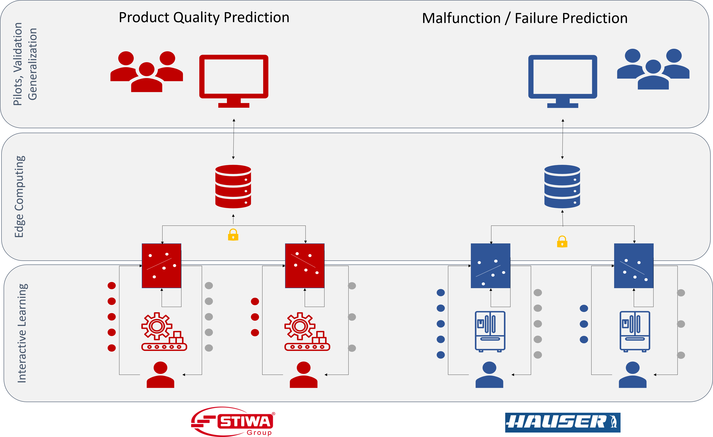

#  Initial Situation, Problem and Motivation 

 The value of predictive modelling in production processes is well-understood nowadays. However, missing or insufficient ground-truth data (e.g., failure recordings, quality assessments) has become a major obstacle for most industry use cases. In addition, due to legal and computational requirements, a paradigm shift from central, cloud-based approaches to federated data analysis and learning approaches can be observed. At the moment, it remains largely unclear how to respond to this situation and need, since research in this field is still in an early stage and successful proof-of-concept (PoC) implementations, demonstrating added value of possible approaches, are still missing. 

# Goals and Innovation

 The goal of INTERACTIVE is to design and develop workflows and algorithmic methods that enable machine learning in distributed edge computing environments despite missing or insufficient ground-truth data. Resulting workflows and algorithms will be implemented for two distinct Proof-of-Concept (PoC) use cases: (i) product quality prediction in high-performance automation (STIWA), and (ii) predictive maintenance for cooling facilities (HAUSER). A systematic evaluation of both PoCs will provide insight into the general applicability of developed interactive machine learning workflows and algorithms and show to what extent they can be applied to other use cases and assets. 

# Expected Results and Insights

 From a scientific, technical perspective, INTERACTIVE will (i) design federated, interactive machine learning workflows that scale for industrial assets of the same technology, (ii) provide software libraries implementing interactive learning methods and data labelling user interfaces for both PoCs, (iii) design edge computing architectures and federated learning algorithms allowing training of models without transferring large amounts of raw data to central servers, and (iv) implement two PoCs, allowing validation of project results and measurements of target achievements. Expected results will provide insights and allow the quantification of efficiency gains and reduction of raw material and energy consumption achieved by implementing active learning methods near the industrial production process (STIWA) or near industrial refrigeration systems, which are deployed in hundreds of locations around the world (HAUSER). In both use cases, the expectation is a 25-50% increase in efficiency. 

INTERACTIVE maintained by <a href="https://github.com/behas" style="color: black;">Dr. Bernhard Haslhofer</a> 
Programm: Produktion der Zukunft - 36. AS PdZ - Nationale Projekte 2020 - 883855  
Last update: 10.06.2021   
Published with <a href="https://pages.github.com/" style="color: black;">GitHub Pages</a>

