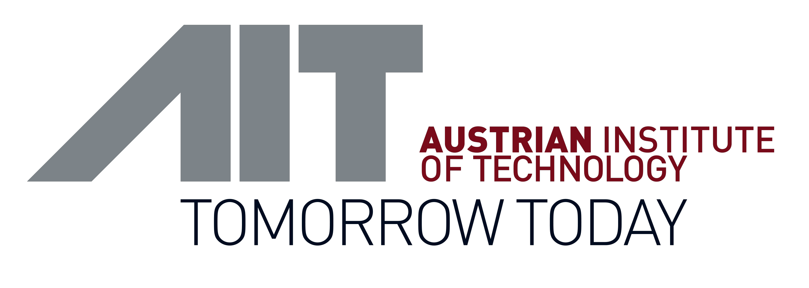
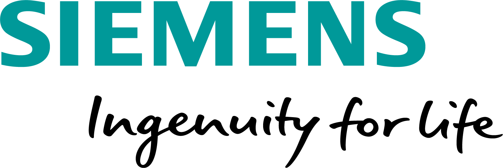
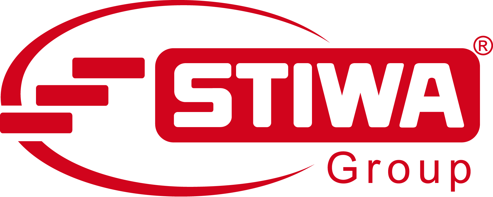
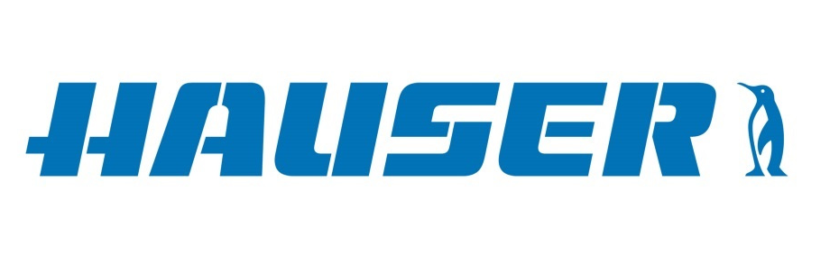

# Austrian Institute of Technology

    

<a href="https://www.ait.ac.at/">AIT</a>, which is Austria's largest research and technology organization, will be involved with two competence units: Data Science & Artificial Intelligence (DSAI) as well as Technology Experience (TE). Capabilities of AIT are: Data Science & Artificial Intelligence with a strong focus on machine learning, software development, experience in running horizontally scalable cluster infrastructures, as well as a deep and cross-domain understanding of user experience assessment and interaction design for ubiquitous automated environments.
       

 		
        

    

# Siemens AG Österreich

    

<a href="https://new.siemens.com/at/de.html">Siemens AG Österreich</a> employs around 8,000 people in Austria comprising know-how of the entire value chain. Siemens AG Österreich will be involved with the ‘Distributed-AI-Systems’ (DAS) research group of ‘Corporate Technology’. The research group performs AI research in cloud-edge systems applied in the digital industries context focusing on the topics of Transfer Learning, Federated Learning, Cloud-Edge AI deployment, AI hardware acceleration, real-time data monitoring, anomaly detection and distributed active learning.

       

        

    

 
# STIWA

    

<a href="https://www.stiwa.com/">STIWA</a> is an experienced partner in product and high-performance automation. Its core competencies include product and software development for manufacturing automation, supplier production of metal and plastic components, energy-efficient building technology and laboratory automation. As an equipment manufacturer that also uses its own machines for serial production and develops its own automation software STIWA has direct access and detailed knowledge of all the processes involved in the production process.
 
       

	
        

    

# HAUSER

    

As a project partner, <a href="http://hauser.com/">HAUSER</a> has 70 years of experience in the field of refrigeration technology. In connection with the project INTERACTIVE, HAUSER evaluates results from data analysis of cooling Systems with the project partners AIT & Siemens. Capabilities
       

  
        

    

